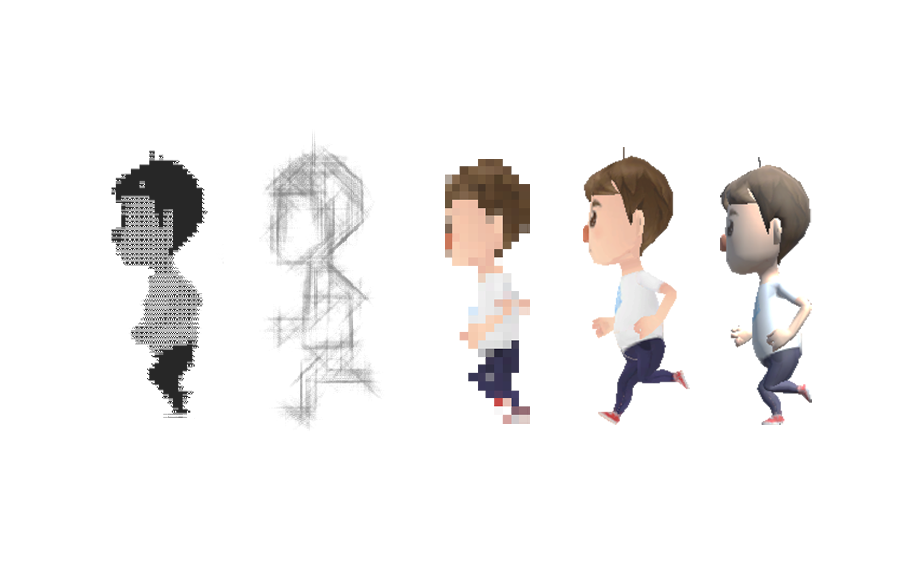
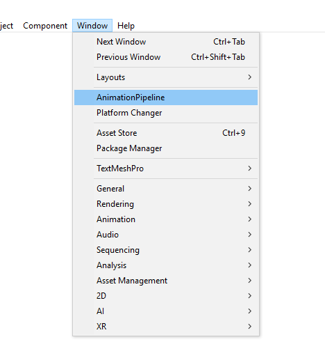
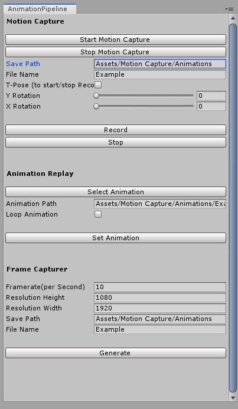

[![Issues][issues-shield]][issues-url]
[![MIT License][license-shield]][license-url]
[![LinkedIn][linkedin-shield]][linkedin-url]

<!-- PROJECT LOGO -->
 

  

  <h3 align="center">2D Sprite Animation Pipeline</h3>

  

    Generating 2D Sprites from Motion Capture Information and 3D Animations
     
    <a href="https://github.com/michaelcruzcervera/AnimationPipeline">View Demo</a>
    ·
    <a href="https://github.com/michaelcruzcervera/AnimationPipeline/issues">Report Bug</a>
    ·
    <a href="https://github.com/michaelcruzcervera/AnimationPipeline/issues">Request Feature</a>
  

<!-- TABLE OF CONTENTS -->
## Table of Contents

* [About the Project](#about-the-project)
  * [Built With](#built-with)
* [Relevant Standards](#relevant-standards)
* [Usage](#usage)
* [License](#license)
* [Contact](#contact)
* [Acknowledgements](#acknowledgements)

<!-- ABOUT THE PROJECT -->
## About The Project

The objective of this project was to produce a general motion-capture pipeline for producing 2D assets for videogames and interactive media, with a large focus on reducing the legwork and costs associated with animation within small Indie companies.

The final product is a pipeline that is broken up into the following components which can be used independently of each other:
*	Motion Capture System
*	Animation Selection and Replay
*	Image Effect Shaders and post processing
*	Frame Capturer

The tracking data of the motion capture actor is translated via rotations to the character model, and then recorded as a generic 3D animation. 

The selected animation is then stylised by applying Image Effect Shaders and postprocessing to the main camera within the Unity project.

  

The system is then able to generate a 2D sprite animation, by capturing frames of via the main camera, at a specified resolution with a transparent background. 

### Built With

* [Unity](https://unity.com/)
* [Nuitrack](https://nuitrack.com/)
* [c#](https://docs.microsoft.com/en-us/dotnet/csharp/)
* [Kinect V2](https://www.microsoft.com/en-gb/download/details.aspx?id=44561)

### Relevant Standards

* Unity 2019.1.0 or higher
* Kinect V2
* Nuitrack v.0.27.0 (license)

<!-- USAGE EXAMPLES -->
## Usage

The entire pipeline is controlled within a custom editor that allows you to modify the available settings, resulting in a refined, simple user experience.

  
  

<!-- LICENSE -->
## License

Distributed under the MIT License. See `LICENSE` for more information.

<!-- CONTACT -->
## Contact

Michael Cruz Cervera - michaelcruz1998@hotmail.com

<!-- ACKNOWLEDGEMENTS -->
## Acknowledgements

Dr Karina Rodriguez Echavarria: Porject Supervisor
[SuperCyan](https://assetstore.unity.com/packages/3d/characters/humanoids/character-pack-free-sample-79870)
[ORANGE030](https://assetstore.unity.com/packages/tools/transparency-capture-509)

<!-- MARKDOWN LINKS & IMAGES -->
<!-- https://www.markdownguide.org/basic-syntax/#reference-style-links -->
[contributors-shield]: https://img.shields.io/github/contributors/othneildrew/Best-README-Template.svg?style=flat-square
[contributors-url]: https://github.com/michaelcruzcervera/AnimationPipeline/graphs/contributors
[forks-url]: https://github.com/michaelcruzcervera/AnimationPipeline/network/members
[stars-shield]: https://img.shields.io/github/stars/othneildrew/Best-README-Template.svg?style=flat-square
[stars-url]: https://github.com/michaelcruzcervera/AnimationPipeline/stargazers
[issues-shield]: https://img.shields.io/github/issues/othneildrew/Best-README-Template.svg?style=flat-square
[issues-url]: https://github.com/michaelcruzcervera/AnimationPipeline/issues
[license-shield]: https://img.shields.io/github/license/othneildrew/Best-README-Template.svg?style=flat-square
[license-url]: https://github.com/michaelcruzcervera/AnimationPipeline/LICENSE.txt
[linkedin-shield]: https://img.shields.io/badge/-LinkedIn-black.svg?style=flat-square&logo=linkedin&colorB=555
[linkedin-url]: https://www.linkedin.com/in/michael-cruz-cervera/
